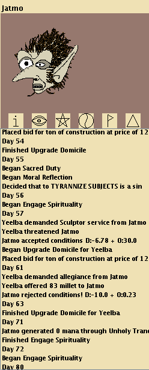
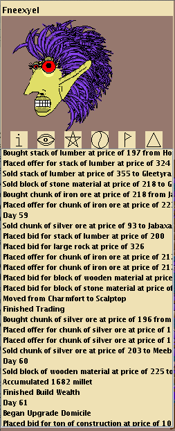
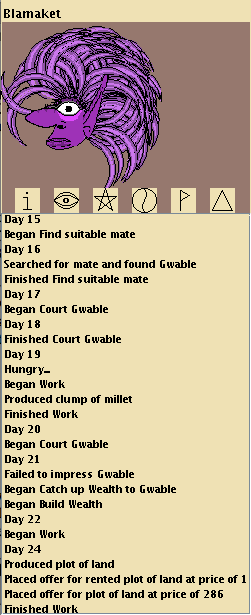
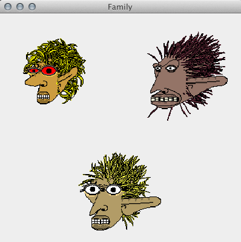
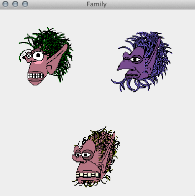
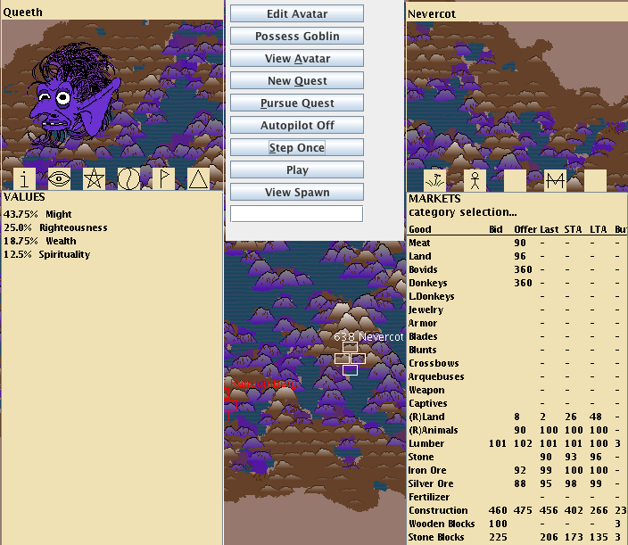
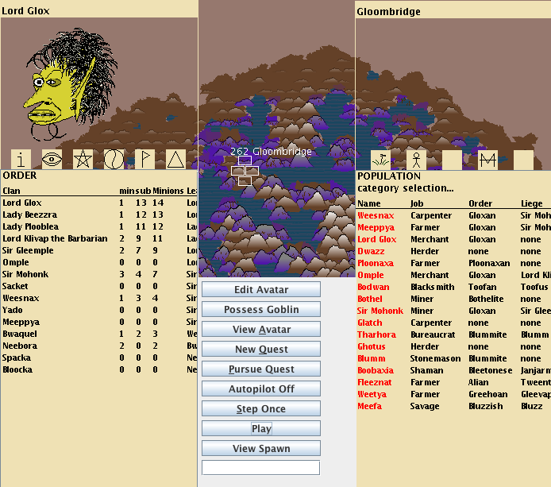

AUTONOMOUS GOBLIN PARADISE: INTRODUCTION 

I. Basic 

AGP is an artificial society simulation. 
The Realm is divided into Shires populated by Goblins. 
Shires contain resources which change as Goblins act upon them or periodically by nature. Base resources vary from Shire to Shire. 
Goblins are autonomous agents inhabiting the Realm that can interact with each other and with their environment. 
The Goblin AI is based on an "artificial value system." This means that their behavior is determined by their subjective individual ideologies. 

II. Values 

A Value is a global variable accessed by Goblins when making decisions. 
The most important components of a Value are its RespectFunction and QuestGenerator. 

RespectFunction is a function f(pov, a, b) that determines on a bounded numerical scale the Value-specific respect Goblin "pov" feels for Goblin "a" versus the respect "pov" feels for Goblin "b." 
This allows respect to be subjective, relative, transitive, and combinable. 
Note that this is Value-specific respect, not final respect. Final respect is aggregated across many Values, and is not transitive. 

QuestGenerator returns a Quest that a Goblin assumes when looking for something to do and this Value is activated. 

There are 12 Values hard-coded in AGP: Knowledge, Wealth, Allegiance, Copulation, Expertise, Influence, Righteousness, Beauty, Spirituality, Might, Legacy, and Harmony. 
Let's look at an example: 

WEALTH { 
	RespectFunction = ln(nav(a, pov) / nav(b, pov)) where nav(x, pov) (net asset value) is a function summing up the value of x's assets by pov's market prices. 
	QuestGenerator returns new BuildWealthQuest(pov) where BuildWealthQuest is a Quest that specifies the actions pov will take to increase his wealth 
} 

III. Ideologies 

Each Goblin has an Ideology, or value system, which is basically just a relative weighting of the importance of each Value to that Goblin. 
For example, a Goblin with 100% Value-Wealth in his Ideology will only respect other Goblins according to how wealthy they are and will spend most of his time working on increasing his own wealth. 

Ideologies can change over the life of a Goblin through three mechanisms: Respect-Driven Learning, Cognitive Dissonance, and Meme Mutation. 

Respect-Driven Learning is the acquisition of beliefs from someone of high respect. A Goblin can thereby alter his own Ideology by copying the Ideology of another Goblin he respects. 
Example: Goblin "Praznat" with 100% Value-Wealth meets Goblin "Gheetwa" who is 2x wealthier than Praznat but whose Ideology is 50% Value-Wealth and 50% Value-Righteousness. After this encounter, Praznat may become 80% Value-Wealth and 20% Value-Righteousness. 

Cognitive Dissonance can happen when a Goblin loses self-respect according to his current Ideology. He may alter his Ideology incrementally to raise his self-respect rather than work to improve this measure by his current Ideology. 
Example: Goblin "Praznat" with 100% Value-Wealth is the poorest Goblin in his Shire, but the most good-looking. Tired of being jealous of the other Goblin's wealth, he may alter his Ideology to 70% Value-Wealth and 30% Value-Beauty in order to raise self-respect. 
Cognitive dissonance is an aversion to holding conflicting beliefs. Goblins have an overconfidence bias much like humans. Cognitive dissonance works to shift goblin's mentality this way because a goblin's overconfidence is unshakeable. 

Meme Mutation is the infrequent random alteration of a Goblin's behavioral properties. 
Example: Goblin "Praznat" with 100% Value-Wealth is minding his own business when suddenly he has a vision and changes his ideology to 50% Value-Wealth and 50% Value-Spirituality. 

IV. Quests 

Quests are the basic definitions of every kind of action a Goblin can take. When a Goblin starts a Quest, the Quest definition specifies what happens and under what conditions he succeeds or fails. 
Quests can last any number of turns. They can spawn new Quests. They can influence almost anything else in the simulation. 
Quest definitions are complex and take up the majority of AGP's code. 

Example Quest: 
WORK-CARPENTRY { 
	Step 1: determine highest profit margin inputs and outputs from inputs [wood] and outputs [plow, spear, frame...] 
	Step 2: determine optimal bids for inputs and place orders in market 
	Step 3: if bids are filled, go to Step 4, otherwise go to Step 2 
	Step 4: turn inputs into outputs 
	Step 5: determine optimal offers for outputs and place orders in market 
	Step 6: if profit is much less than estimated add new Quest REOPTIMIZE-WORK-BEHAVIORS 
} 

V. Behaviors 

Behaviors are Goblin-specific parameters that influence how they act. 
Examples: 
a Goblin with high BEHAVIOR-TENACITY will change his ideology in small increments 
a Goblin with high BEHAVIOR-RISK-AVERSION will place orders close to the nearest bid or offer in the market. 
a Goblin with high BEHAVIOR-PROMISCUITY will be likely to accept an invitation to copulate with a Goblin different from his last mate. 
Behaviors can change over the life of a Goblin in the same three ways that Ideology do, as well as a fourth way: Knowledge Application. 
Knowledge Application is when a piece of knowledge stored in a Shire's library is accessed by a Goblin and used to optimize his Behaviors. 
Example: Goblin "Praznat," a carpenter, is on Quest REOPTIMIZE-WORK-BEHAVIORS, which makes him access knowledge about a neighboring Shire with cheaper wood and decide to move to there. 

VI. Appendix 1 : Value Definitions 

Knowledge 
Goblins can gather knowledge and store it in a Shire's library. Every time a piece of knowledge is used by some Goblin, its discoverer's perceived Wisdom increases. 
Respect is determined by Wisdom. Knowledge-valuing Goblins will spend time collecting knowledge. 

Wealth 
Goblins have jobs that they can choose or be given, whereby they work and collect assets. 
Respect is determined by Net Asset Value according to a subjective market value. Wealth-valuing Goblins will spend time working or otherwise gaining assets. 

Allegiance 
Goblins can organize into Orders (like a guild or a country). A Goblin will join another Goblin's if invited and the invitee respects the inviter more than his current liege. 
Respect is determined by rank in the Order and by being of the same Order. An Allegiance-valuing Goblin will spend time serving the Order. 

Copulation 
Goblins reproduce by finding mates. There is a complex Quest system that allows for flirtation, love-triangles, affairs, and all that juicy stuff. 
Respect is determined by number of offspring. A Copulation-valuing Goblin will try to optimize copulation by some combination of quantity and quality of mates. 

Expertise 
Goblins have Skills that determine their success in certain activities. For example, a carpenter's Skill determines how much wood he needs to craft something. 
Respect is determined by the depth and breadth of a Goblin's Skills. An Expertise-valuing Goblin will do things to improve Skill like practice or find a teacher. 

Influence 
Goblin Orders are hierarchical, with each Goblin having at most one liege and any number of minions. 
Respect is determined by number of minions (and sub-minions). An Influence-valuing Goblin will try to increase minions, by recruiting and by raising popularity (respect). 

Righteousness 
A global Commandments system exists. For any given Goblin some combination of Commandments may be considered "active." When a Goblin breaks a Commandment he gains a sin in that Commandment, whether it is active or not. 
Respect is determined by a judgement by "pov," according to "pov"'s active Commandments, on another Goblin's sins. 
For example Goblin "Blount" with 100% Value-Righteousness and only Commandment-Vegetarianism active respects "Praznat" more than "Gheetwa" if Gheetwa eats more meat than Praznat. A Righteousness-valuing Goblin will spend time trying to impose Commandments on other goblins, and will not act in ways that generate sins for himself. 

Beauty 
Goblins have some features which are fixed and genetic and other features such as hair length or amount of jewelry which are changeable. 
Respect is determined by a judgement by "pov," based on some of "pov"'s Behaviors, on another Goblin's beauty features. A Beauty-valuing Goblin will spend time trying to maximize beauty, e.g. by accumulating jewelry, monuments, etc. 

Spirituality 
There are rituals that can be performed to raise a Goblin's perceived Holiness (e.g. prayers, dances, sacrifices, etc). A Goblin's favored ritual is determined by his Behaviors. The Holiness gained by a ritual is determined by multiple factors. 
Respect is determined by Holiness. A Spirituality-valuing Goblin will spend time performing rituals. 

Might 
Goblins can demand supplication, tribute, religious conversion, etc from other Goblins by threatening violence. Goblins can form armies and attack other Goblins. 
Respect is determined by estimated probability of winning a fight. A Might-valuing Goblin will spend time accumulating armies, weapons, supplies, and territory. 

Legacy 
Goblins pass on many things to their progenitors, such as assets, Skills, Behaviors, Ideologies, and Legacy. Legacy is a kind of record of maximum ancestral achievements per Value. 
Respect is determined by an assessment of maximum ancestral achievements according to a subjective Ideology. A Legacy-valuing Goblin will spend time improving legacy by hiring bards/historians and nurturing offspring. 

Harmony 
Goblins have an emotional Stress system. When Quests fail or when something bad happens, Goblins will attribute Stress to whatever they decide to blame, usually another Goblin, Shire, or Order. Quest success or atonement through action against stressor can relieve Stress. 
Respect is determined by a judgement by "pov" on the amount of Stress caused or relieved by another Goblin. A Harmony-valuing Goblin will spend time reducing Stress in others. This may involving conspiring with others against a common enemy, atoning for one's own mistreatment of others, or investing in the home Shire. 

**********************

CONTROL GUIDE

There are two ways a human can interact with Autonomous Goblin Paradise: 
1. observe the goblins' autonomous behavior 
2. mind-control the goblins 

Observer Controls 

1. Realm observation 

The map in the background shows the approximately 1000 Shires generated at initialization. The outer light-brown area is uninhabitable nothingness. Inhabitable Shires contain four terrain plots that may be brown, green, or blue depending on rainfall, and more or less mountainous depending on altitude. Hover over a plot to see its number, its name, and its encompassing four terrain plots in red. Click on the Shire to view it in the Shire observation panel. 

2. Shire observation 

The off-yellow box on the right displays information about a Shire. The five boxes in the middle can be clicked to display different types of information.
•The flower-looking thing displays Shire resources and assets. Right now it only shows what's in the Shire's Knowledge Library. 
•The stick figure shows information on the Shire's inhabitants. Click a goblin's name in red to view him/her in the Goblin observation panel. 
•The M with a line through it shows market information, prices and orders for each tradeable good. 
•The blank boxes will eventually show other info, for now they default to population info.

3. Goblin observation 

The off-yellow box on the left displays information about a goblin. At the top under the name is an accurate visualization of the goblin's face. Click for crude animation. There are six boxes in the middle to click for subcategories of information.
•The "i" button shows basic info like name, location, job, liege, lover, and various assets and attributes. 
•The eye displays the goblin's ideology, his/her weighing of different values. 
•The star shows skills and prestige, most of these don't do anything yet. 
•The yin-yang describes the goblin's behavioral traits. Some of these are also not used yet. 
•The flag shows quest information. At the top is the quest stack, lower down is the GobLog (description of recent activity). 
•The triangle is Order information. This displays member goblins in descending rank order.

4. Time control 

The grey box in the middle is a general control panel. Most of it is for avatar control, but it is also necessary for making time pass and stop. Make sure you press "Autopilot off" first. Then you can press "Play/Pause" to control time. 

Avatar Controls 

The grey box in the middle can be used to manually interfere with the goblins' autonomy. It is currently a major haven for bugs. Using it will likely cause any goblins that interact with the avatar to behave abnormally. 
•Edit Avatar: Play with the look of your goblin's face. Changes not permanent. 
•Possess Goblin: Unhappy with your avatar? Find a goblin you like, select in goblin observation panel, then press this to change avatar. 
•View Avatar: Click this to select your avatar in the goblin observation panel. 
•New Quest: Add a quest of your choice to the stack. Beware of likely bugs. 
•Pursue Quest: Manually act on the current quest. 
•Autopilot On/Off: If it says "off" then it's currently on, and vice versa. Click to change. Autopilot means you won't be asked to make decisions for the avatar. 
•Step once: Make one turn pass. 
•Play/pause: Start time or stop it. Buggy. 
•View spawn: Brings up hypothetical offspring of avatar and goblin selected in observation panel. Click on offspring in the middle to randomly regenerate. These offspring are not real goblins, just something to play with.

